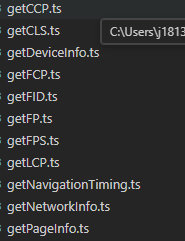
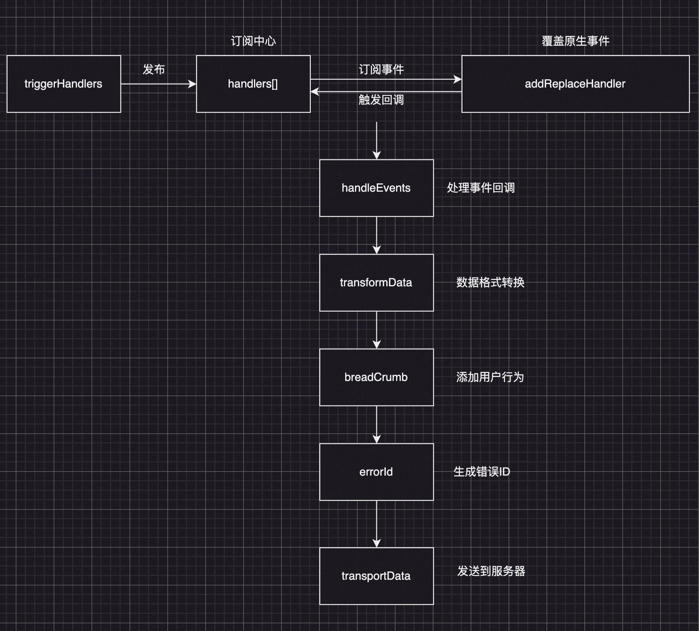

# frontend-monitor 前端监控

## 前端监控体系介绍

一般来说，前端搭建监控体系，可以概括为为了做两件事：如何及时发现问题、如何快速定位问题，而为了解决这两个问题，前端监控体系需要关注的点可以拆分为如下：

- 页面的性能情况：包括各阶段加载耗时，一些关键性的用户体验指标等
- 用户的行为情况：包括PV、UV、访问来路，路由跳转等
- 接口的调用情况：通过http访问的外部接口的成功率、耗时情况等
- 页面的稳定情况：各种前端异常等
- 数据上报及优化：如何将监控捕获到的数据优雅的上报

所以，主要包含三部分：

1. 收集错误：前端嵌入监控SDK，收集错误信息；
2. 存储&整理错误：服务端对错误信息做过滤整合，存表落库；
3. 数据看板：通过可视化看板渲染错误信息，方便定位问题及告警；

## 文件管理架构：

pnpm+monorepo

```Markdown
├── README.md
├── package.json
├── packages
│   ├── browser
│   │   ├── README.md
│   │   ├── package.json
│   │   └── src
│   ├── core
│   │   ├── README.md
│   │   ├── package.json
│   │   └── src
│   ├── react
│   │   ├── README.md
│   │   ├── package.json
│   │   └── src
│   ├── shared
│   │   ├── README.md
│   │   ├── package.json
│   │   └── src
│   ├── types
│   │   ├── README.md
│   │   ├── package.json
│   │   └── src
│   ├── utils
│   │   ├── README.md
│   │   ├── package.json
│   │   └── src
│   ├── vue
│   │   ├── README.md
│   │   ├── package.json
│   │   └── src
│   ├── web
│   │   ├── README.md
│   │   ├── package.json
│   │   └── src
│   ├── web-performance
│   │   ├── README.md
│   │   ├── package.json
│   │   └── src
│   ├── wx-miniprogram(小程序)
│   │   ├── README.md
│   │   ├── package.json
│   │   └── src
│   └── wx-miniprogram-performance
│       ├── README.md
│       ├── package.json
│       └── src
├── pnpm-lock.yaml
├── pnpm-workspace.yaml
└── tsconfig.json
```

## 已实现:

1. ### 错误信息监控(web+小程序）

   1 接口报错 2 代码资源异常 3 unhandledrejection异常

2. ### 用户行为收集

   1 dom事件 2 路由切换 3 用户日志

3. ### 框架异常收集

   1 vue 2 react

4. ### 性能指标收集

​	

> 参考：[网页核心指标性能](https://web.dev/articles/vitals?hl=zh-cn)

## 架构设计




TODO:
1. `Node`层作为数据清洗层，进行的常见的数据清洗规则及使用 使用`Node+mysql+redis`进行持久化的数据存储，及稳定性指标的展示+告警系统
2. JSON`录屏`监控报警+`sourcemap`定位源码+采样判断白屏
3. 多端适配(RN 小程序 web)

